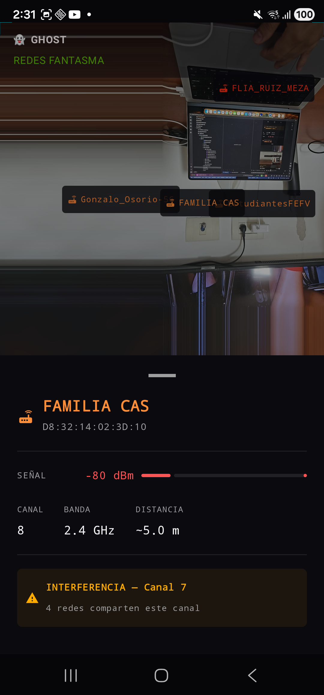
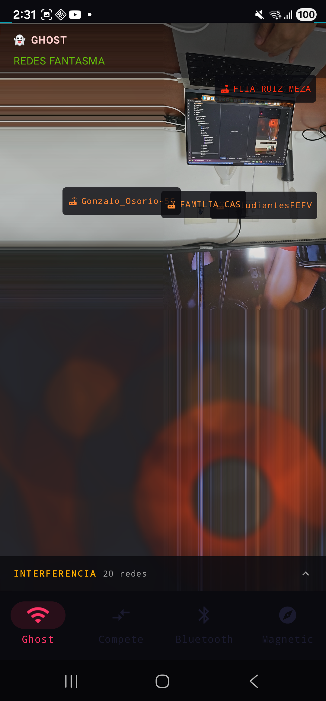
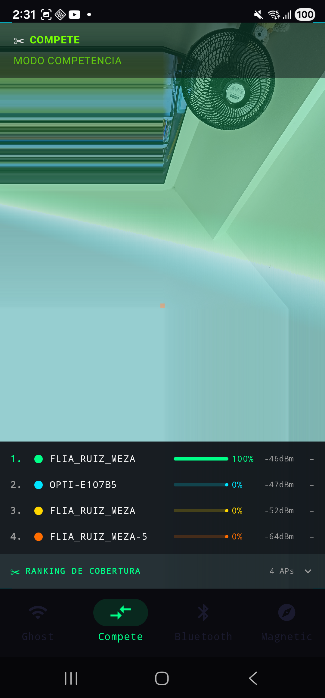
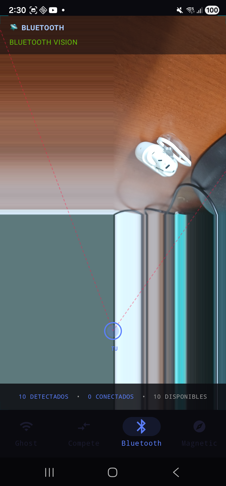
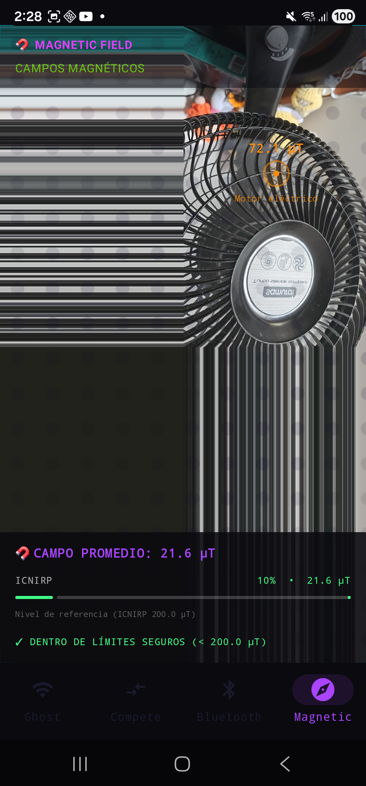

# Invisible Spectrum

[](LICENSE)
[](https://android.com)
[](https://developer.android.com/about/versions/oreo)

**Android AR app that visualizes the invisible electromagnetic spectrum in real time.**

Four sensor modes overlaid on the camera feed using ARCore and OpenGL ES shaders.

> 🌐 **Landing page:** [rich4rdruizgit.github.io/spectrum](https://rich4rdruizgit.github.io/spectrum)

---

## Modes

| Mode | Sensor | Description |
|------|--------|-------------|
| **Ghost** | WiFi | AR labels for nearby networks. Tap any label to see signal, channel, band, estimated distance and interference alerts. |
| **Compete** | WiFi | Coverage ranking. Real-time scoreboard with signal bars and dBm values per AP. |
| **BT Vision** | Bluetooth | Constellation of nearby Bluetooth devices, classified by type (headphones, watch, speaker, phone). |
| **Mag Field** | Magnetometer | Reactive dot-grid GLSL shader driven by magnetic field magnitude. Anomaly detection with signature classification (motor, transformer, magnet, cable, etc.) and ICNIRP reference bar. |

---

## Screenshots

<table>
  <tr>
    <td align="center"><br/><sub>Ghost</sub></td>
    <td align="center"><br/><sub>Ghost · Detail</sub></td>
    <td align="center"><br/><sub>Compete</sub></td>
    <td align="center"><br/><sub>BT Vision</sub></td>
    <td align="center"><br/><sub>Mag Field</sub></td>
  </tr>
</table>

---

## Tech Stack

- **Kotlin + Jetpack Compose** — declarative UI, typed navigation
- **ARCore** — AR session with lifecycle management
- **OpenGL ES 3.0** — fullscreen quad shaders per mode (GLSL)
- **Hilt** — dependency injection (ViewModels, repositories, session manager)
- **StateFlow + Coroutines** — reactive sensor pipeline
- **Android Sensor APIs** — WiFi Scanner, Bluetooth LE, Magnetometer

### Architecture

Clean layered architecture per mode:

```
SensorRepository → ViewModel → AtomicReference<RenderData> → OverlayRenderer (GL thread)
                             → StateFlow<UiState>           → Compose HUD (main thread)
```

---

## Requirements

- Android 8.0+ (API 26)
- ARCore-compatible device — [check list](https://developers.google.com/ar/devices)
- Permissions: `CAMERA`, `ACCESS_FINE_LOCATION`, `BLUETOOTH_SCAN`

> Does **not** work on emulator — requires physical device with camera and sensors.

---

## How to Run

```bash
git clone https://github.com/rich4rdruizgit/spectrum.git
```

1. Open in **Android Studio Hedgehog** or later
2. Connect an ARCore-compatible Android device (USB or Wireless Debugging)
3. Select the `app` run configuration and press **Run ▶**

Or via CLI:

```bash
./gradlew installDebug
```

Grant permissions on first launch of each mode (camera, location, Bluetooth).

---

## Project Structure

```
app/src/main/
├── java/co/doubler/spectrum/
│   ├── ar/                    # ARCore session manager
│   ├── data/                  # Sensor repositories (WiFi, BT, Magnetic) + fake implementations
│   ├── domain/model/          # Domain models + MagneticSignatureClassifier
│   ├── presentation/
│   │   ├── components/        # ArSceneView, HudOverlay, CoverageScoreboard, etc.
│   │   ├── model/             # UI state models per mode
│   │   ├── navigation/        # AppNavigation (typed routes)
│   │   ├── screen/            # GhostScreen, CompeteScreen, BluetoothScreen, MagFieldScreen
│   │   └── viewmodel/         # ViewModel per mode
│   ├── rendering/             # OverlayRenderer per mode (GL thread)
│   └── util/                  # Constants, permissions, extensions
└── res/raw/                   # GLSL shaders (one per mode)
```

---

## Landing Page

Live demo page: [rich4rdruizgit.github.io/spectrum](https://rich4rdruizgit.github.io/spectrum)

---

## License

MIT © 2026 Richard Ruiz — see [LICENSE](LICENSE) for details.
